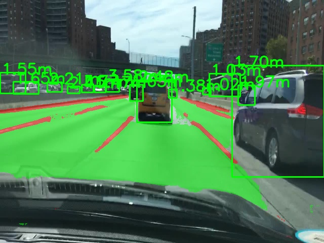
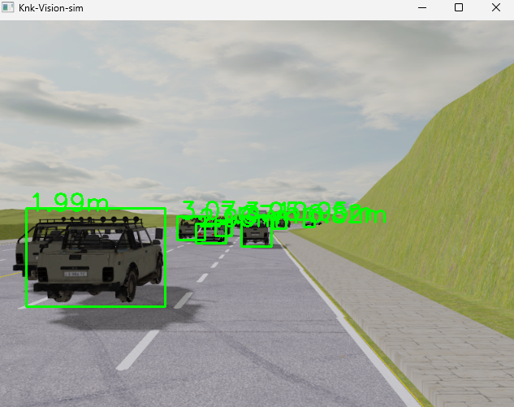

# K and K autonomous


K and K Autonomous is an autonomous driving system that leverages the Deep Learning methods for depth estimation,object detection,lane segmentation and Rule-based planning. The system is designed to assist in driving by maintaining lane centering and providing driving assistance.

# Knk-Vision
KNK-Vision is a computer vision module used for vehicle detection, lane detection, and depth estimation from monocular camera images.KNK-Vision uses the [**YOLOP**](https://github.com/hustvl/YOLOP) for real-time lane segmentation and vehicle detection. Depth estimation is done using [**Vidar**](https://github.com/TRI-ML/vidar)
### Demo

#### After inference


#### MetaDrive inference


## Installation

Follow these steps to set up the KNK-Vision environment and install the necessary dependencies:

1. Clone the repository:
`git clone https://github.com/geci-final/knk-autonomous`

2. Navigate to the cloned repository:
    ```bash
    cd knk-autonomous
    ```

3. If you haven't already, [install conda](https://docs.conda.io/projects/conda/en/latest/user-guide/install/index.html).

4. Create a new conda environment from the `environment.yaml` file:
    ```bash
    conda env create -f environment.yml
    ```
5. Activate the new environment:
    ```bash
    conda activate knk-autonomous
    ```
## Contributing

We welcome contributions!
